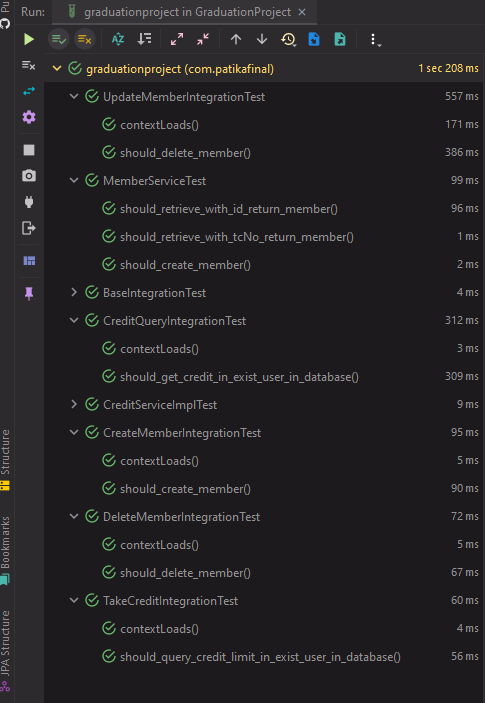

# 
 Patika.dev & Payten Spring Bootcamp Final Ödevi 

## 
 Proje heroku üzerinden live olarak, frontend tymeleaf üzerinden tasarlanılarak uygulanmıştır. Site biraz geç açılmaktadır. (1-2 Dk) Açıldıktan sonra düzelmektedir. 

>  [Siteye gitmek için tıklayınız.](https://gradproject-payten-patika.herokuapp.com) 

# 
 Sistemin Çalışma Videosu

# 
  Çalıştırma Talimatları 

***Projenin backendinde kullanılan Api, Mock, Integration testleri bu repo üzerinden paylaşılmıştır. Ayrıca frontend ve backendin bir arada olduğu proje ayrı olarak herokuapp dosyası üzerinden paylaşılmıştır. Backend apisini çalıştırmak için;***

>  git clone https://github.com/alicanli1995/PatikaPaytenFinalProject.git

>  cd PatikaPaytenFinalProject

>  docker build -t patika-grad-project.jar .

>  docker-compose -f docker-compose.yml up -d

*Projenin api testlerini POSTMAN üzerinden test edebilirsiniz gerekli hazır postman test dosyasına [BURAYA](https://github.com/alicanli1995/PatikaPaytenFinalProject/blob/main/PostmanTest.json)  tıklayarak ulaşıp test edebilirsiniz. Api testine kolaylık açısından Spring Security devre dışı bırakılmıştır. Heroku üzerinden paylaşılan projede spring security aktiftir.*

# 
 Test

*Mock ve Integration test sonuçları aşağıda ki gibidir.*

# 
 Proje Açıklaması

1.  Backend :
    * Kullanıcıdan kimlik numarası, ad-soyad, aylık gelir ve telefon bilgileri alınarak, kimlik
    numarasıyla daha önceden yazıldığı varsayılan kredi skoru servisine gidilir ve ilgili
    kişiye ait kredi skoru alınarak aşağıdaki kurallara göre kullanıcıya kredi sonucu
    gösterilir.
    (Onay veya Red olarak iki seçenek olabilir.)

2.  Frontend: (opsiyonel):
    * Kimlik numarası, ad-soyad, aylık gelir ve telefon bilgileri form ile alınır ve kullanıcıya
    kredi sonucu ve kredi limiti gösterilir.
    Projeye öncelikle bir user post edilir ve bu usera ait bir credit query edilir sonra da bu krediyi almak istiyorsa Status/get adresine post isteği atılarak geçerli kredi aktif edilmiş olur.

Projede bütün userları listeleme servisinde Redis Cache kullanılmıştır. Redis cache otomatik olarak dakika da bir temizlenmektedir.

Proje Layered Architecture uygun olarak tasarlanmıştır. Database olarak PostgreSQL kullanılmıştır. ORM olarak Hibarnate kullanılmıştır.

Dockerfile oluşturulmuştur.

Frontend olarak Thymeleaf kullanılmıştır. +(HTML5, CSS) 

Spring security kullanılarak, user ekleyecek ve kredi sorgulaması yapacak kişi Base64 ile şifrelenmiş hesabını oluşturup sistemi kullanabilmektedir.

Projede Api document olarak SWAGGER kullanılmıştır projenin swagger uzantısına [BURAYA](https://gradproject-payten-patika.herokuapp.com/swagger-ui/index.html) tıklayarak ulaşabilirsiniz.

